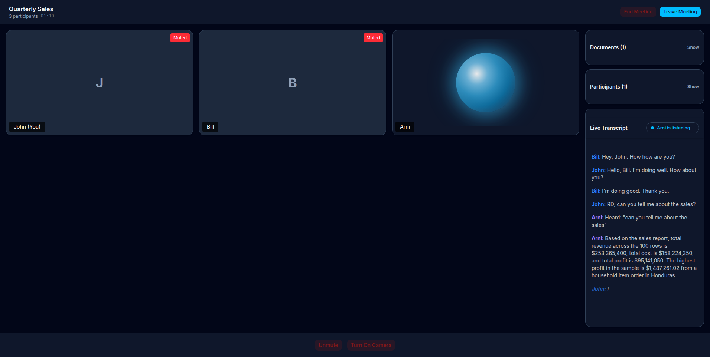
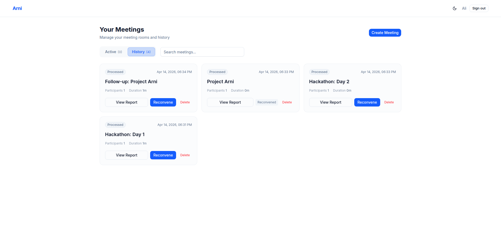
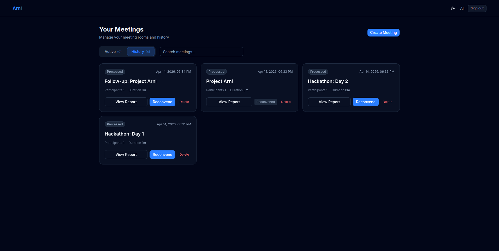
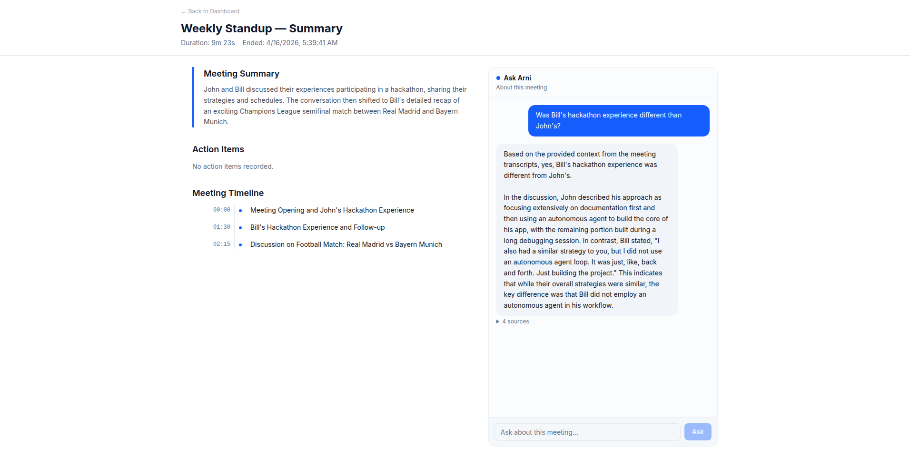
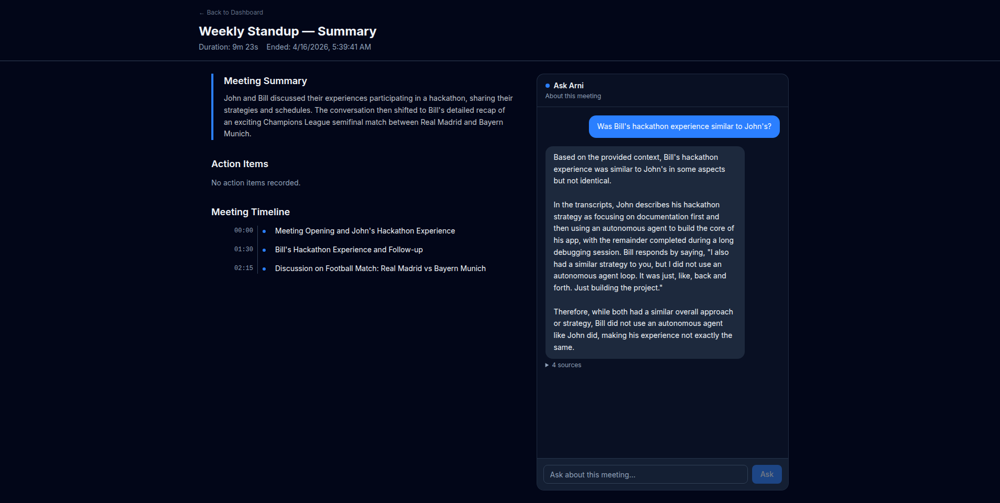

<p align="center">
  <h1 align="center">Arni</h1>
  <p align="center"><strong>AI-Powered Meeting Participant</strong></p>
  <p align="center">
    Arni joins your video meetings as a real-time AI teammate — listening, responding by voice, and generating post-meeting reports automatically.
  </p>
</p>

---

## ✨ Features

- **Real-Time Voice AI** — Arni listens via live transcription and responds with natural TTS voice
- **Wake Word Activation** — Say _"Hey Arni"_ to ask questions mid-meeting
- **Document-Aware RAG** — Upload PDFs, DOCX, or spreadsheets and Arni references them in context
- **Post-Meeting Reports** — Automatic summaries, decisions, action items, and timelines
- **Meeting Reconvene** — Resume previous meetings with full context memory
- **Editable Action Items** — Edit AI-generated action items after the meeting
- **Light & Dark Mode** — Full theme support across the UI

## 📸 Screenshots

### Active Meeting Room
<div align="center">
  
</div>

### Dashboard (Light & Dark)
<div align="center">
  
  
</div>

### Automated Meeting Reports (Post-Meeting Q&A)
<div align="center">
  
  
</div>

## 🏗️ Architecture

```
┌─────────────┐    WebSocket     ┌──────────────┐    REST     ┌──────────┐
│   React UI  │◄──────────────►│  FastAPI      │◄──────────►│  MongoDB  │
│   (Vite)    │                │  Backend      │            │           │
└──────┬──────┘                └──────┬───────┘            └──────────┘
       │                              │
       │  Daily.co WebRTC             ├── Claude/DeepSeek (AI responses)
       │                              ├── ElevenLabs (TTS voice)
       └──────────────────────────────├── Deepgram (transcription)
                                      ├── OpenAI (embeddings for RAG)
                                      └── Redis (event bus)
```

See [`docs/architecture.md`](docs/architecture.md) for the full system design.

## 📋 Prerequisites

| Tool                                               | Version | Purpose                                 |
| -------------------------------------------------- | ------- | --------------------------------------- |
| [Docker](https://docs.docker.com/get-docker/)      | 24+     | Container runtime                       |
| [Docker Compose](https://docs.docker.com/compose/) | v2+     | Multi-container orchestration           |
| [Node.js](https://nodejs.org/)                     | 22+     | Frontend dev (optional if using Docker) |
| [Python](https://python.org/)                      | 3.12+   | Backend dev (optional if using Docker)  |

### Required API Keys

| Service                             | Purpose                 | Free Tier     | Get Key                                            |
| ----------------------------------- | ----------------------- | ------------- | -------------------------------------------------- |
| [Daily.co](https://daily.co)        | Video meetings (WebRTC) | 1,000 min/mo  | [Dashboard](https://dashboard.daily.co/developers) |
| [Deepgram](https://deepgram.com)    | Real-time transcription | $200 credit   | [Console](https://console.deepgram.com)            |
| [DeepSeek](https://deepseek.com)    | AI responses (LLM)      | Pay-as-you-go | [Platform](https://platform.deepseek.com)          |
| [ElevenLabs](https://elevenlabs.io) | Text-to-speech voice    | 10k chars/mo  | [Dashboard](https://elevenlabs.io)                 |
| [OpenAI](https://openai.com)        | Embeddings for RAG      | Pay-as-you-go | [Platform](https://platform.openai.com)            |

## 🚀 Quick Start (Docker)

**1. Clone and configure:**

```bash
git clone https://github.com/your-username/arni.git
cd arni

# Backend environment
cp backend/.env.example backend/.env
# Edit backend/.env and add your API keys

# Frontend environment
cp frontend/.env.example frontend/.env.local
```

**2. Start everything:**

```bash
docker compose up --build
```

**3. Open the app:**

- Frontend: [http://localhost:5173](http://localhost:5173)
- Backend API: [http://localhost:8000](http://localhost:8000)
- API Docs: [http://localhost:8000/docs](http://localhost:8000/docs)

## 🛠️ Manual Setup (Without Docker)

<details>
<summary><strong>Backend</strong></summary>

```bash
cd backend

# Create virtual environment
python -m venv .venv
source .venv/bin/activate  # Windows: .venv\Scripts\activate

# Install dependencies
pip install -r requirements.txt

# Configure environment
cp .env.example .env
# Edit .env with your API keys

# Start the server
uvicorn app.main:app --host 0.0.0.0 --port 8000 --reload
```

> **Note:** You need MongoDB and Redis running locally. Use
> `docker compose up mongodb redis` to start just the databases.

</details>

<details>
<summary><strong>Frontend</strong></summary>

```bash
cd frontend

# Install dependencies
npm install

# Configure environment
cp .env.example .env.local
# Edit .env.local if your backend is not on localhost:8000

# Start dev server
npm run dev
```

</details>

## 🌐 Deploying with Cloudflare Tunnels

To expose your local instance to the internet (e.g., for mobile testing or sharing):

**1. Install Cloudflared:**

```bash
# Debian/Ubuntu
curl -L https://github.com/cloudflare/cloudflared/releases/latest/download/cloudflared-linux-amd64.deb -o cloudflared.deb
sudo dpkg -i cloudflared.deb
rm cloudflared.deb
```

**2. Start tunnels (in separate terminals):**

```bash
# Terminal 1 — Backend tunnel
cloudflared tunnel --url http://localhost:8000

# Terminal 2 — Frontend tunnel
cloudflared tunnel --url http://localhost:5173
```

**3. Update frontend config:**

Each tunnel outputs a unique URL. Copy the backend tunnel URL:

```bash
echo "VITE_BACKEND_URL=https://<your-backend-tunnel>.trycloudflare.com" > frontend/.env.local
```

**4. Restart the frontend** to pick up the new URL.

> ⚠️ Tunnel URLs change every time you restart `cloudflared`. Update `.env.local` each session.

## 🔧 Environment Variables

### Backend (`backend/.env`)

| Variable             | Required | Description                                           |
| -------------------- | -------- | ----------------------------------------------------- |
| `MONGODB_URL`        | Yes      | MongoDB connection string                             |
| `REDIS_URL`          | Yes      | Redis connection string                               |
| `JWT_SECRET`         | Yes      | Secret key for JWT tokens (**change in production!**) |
| `FRONTEND_URL`       | No       | Frontend URL for invite link generation               |
| `BACKEND_URL`        | No       | Backend URL for internal calls (set when using tunnels/proxies) |
| `DAILY_API_KEY`      | Yes      | Daily.co API key                                      |
| `DEEPGRAM_API_KEY`   | Yes      | Deepgram transcription key                            |
| `DEEPSEEK_API_KEY`   | Yes      | DeepSeek LLM API key                                  |
| `ELEVENLABS_API_KEY` | Yes      | ElevenLabs TTS key                                    |
| `OPENAI_API_KEY`     | Yes      | OpenAI embeddings key                                 |
| `GOOGLE_CLIENT_ID`   | No       | Google OAuth client ID                                |
| `CORS_ORIGINS`       | No       | Allowed CORS origins (JSON array)                     |
| `DEBUG`              | No       | Enable debug mode (`True`/`False`)                    |

### Frontend (`frontend/.env.local`)

| Variable           | Required | Description     |
| ------------------ | -------- | --------------- |
| `VITE_BACKEND_URL` | Yes      | Backend API URL |

## 🧪 Testing

```bash
cd backend

# Install test dependencies (included in requirements.txt)
pip install pytest pytest-asyncio

# Run all tests
python -m pytest tests/ -v

# Run a specific test file
python -m pytest tests/test_wake_word.py -v
```

## 📁 Project Structure

```
arni/
├── backend/
│   ├── app/
│   │   ├── ai/            # LLM client, AI service, prompts, reasoning
│   │   ├── bot/           # Daily.co bot, wake word detection
│   │   ├── documents/     # Document upload, chunking, extraction
│   │   ├── events/        # Redis pub/sub event bus
│   │   ├── lobby/         # Meeting lobby & grace period
│   │   ├── models/        # MongoDB document schemas
│   │   ├── postprocessing/ # Post-meeting report pipeline
│   │   ├── rag/           # Embeddings & semantic search
│   │   ├── routers/       # FastAPI route handlers
│   │   ├── scheduler/     # Background task scheduling
│   │   ├── tts/           # ElevenLabs TTS & audio injection
│   │   ├── utils/         # Auth helpers, Daily.co utilities
│   │   └── vad/           # Voice Activity Detection
│   ├── tests/             # pytest test suite
│   ├── .env.example       # Environment template
│   ├── Dockerfile
│   └── requirements.txt
├── frontend/
│   ├── src/
│   │   ├── components/    # Reusable UI components
│   │   ├── context/       # React context providers
│   │   ├── pages/         # Route pages
│   │   └── lib/           # Utilities
│   ├── .env.example       # Environment template
│   ├── Dockerfile
│   └── package.json
├── docs/                  # Architecture, SRS, roadmap
├── docker-compose.yml
└── README.md
```

## 🤝 Contributing

1. Fork the repository
2. Create a feature branch (`git checkout -b feature/amazing-feature`)
3. Commit your changes (`git commit -m 'feat: add amazing feature'`)
4. Push to the branch (`git push origin feature/amazing-feature`)
5. Open a Pull Request

Please follow [Conventional Commits](https://www.conventionalcommits.org/) for commit messages.

## 📄 License

This project is licensed under the MIT License — see the [LICENSE](LICENSE) file for details.
