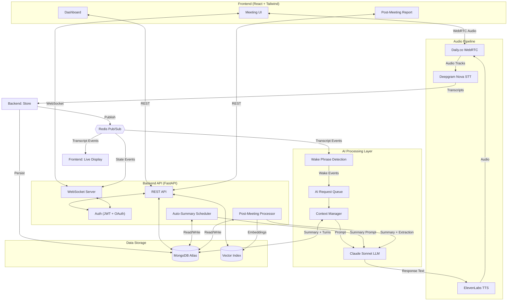
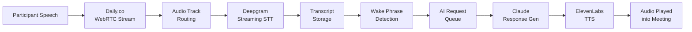
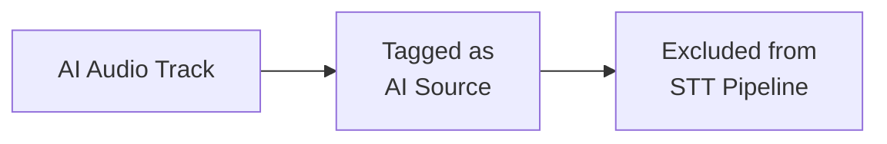
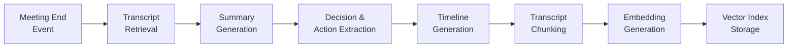
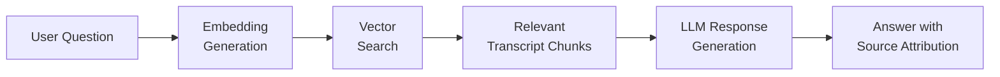
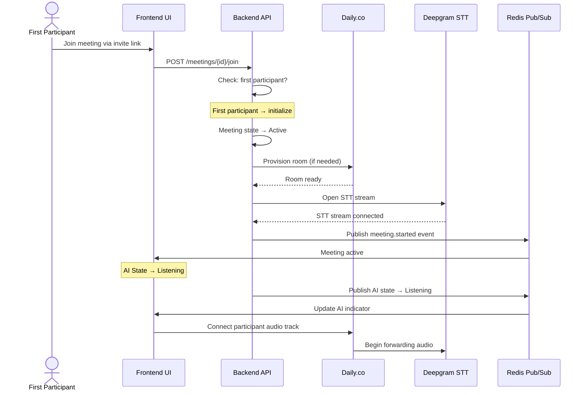
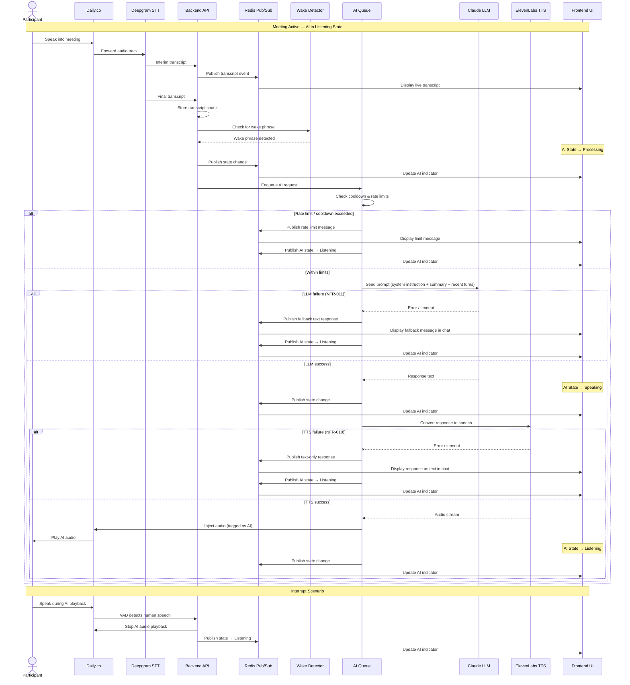
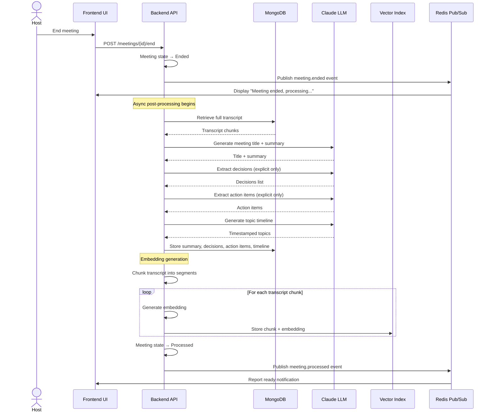
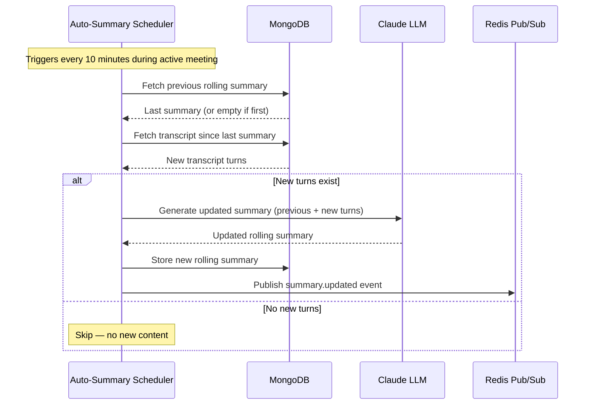

# Arni — System Architecture

Version: 1.0
Date: 2026-03-16

Detailed architecture diagrams and pipeline specifications for the Arni system.

For requirements, see [srs.md](srs.md).

---

## Table of Contents

1. [System Architecture Diagram](#1-system-architecture-diagram)
2. [Live Meeting Pipeline](#2-live-meeting-pipeline)
3. [Audio Feedback Loop Prevention](#3-audio-feedback-loop-prevention)
4. [Post-Meeting Processing Pipeline](#4-post-meeting-processing-pipeline)
5. [Question Answering Pipeline (RAG)](#5-question-answering-pipeline-rag)
6. [Event Bus](#6-event-bus)
7. [Meeting Initialization Sequence](#7-meeting-initialization-sequence)
8. [Live Meeting Sequence Diagram](#8-live-meeting-sequence-diagram)
9. [Post-Meeting Processing Sequence Diagram](#9-post-meeting-processing-sequence-diagram)
10. [Rolling Auto-Summary Flow](#10-rolling-auto-summary-flow)

---

## 1. System Architecture Diagram

---

## 2. Live Meeting Pipeline

---

## 3. Audio Feedback Loop Prevention

AI-generated audio must never be transcribed back into the meeting transcript.

---

## 4. Post-Meeting Processing Pipeline

---

## 5. Question Answering Pipeline (RAG)

---

## 6. Event Bus

Real-time events are managed through **Redis Pub/Sub**.

| Event Type | Description |
|------------|-------------|
| Audio stream events | New audio track connected/disconnected |
| Transcript events | New interim/final transcript available |
| Wake word events | Wake phrase detected in transcript |
| AI state change events | Idle → Listening → Processing → Speaking |
| AI response events | AI response text/audio ready |
| Meeting lifecycle events | Meeting created, started, ended |
| Auto-summary events | Rolling summary regenerated |
| Error events | STT/LLM/TTS failures, reconnections |

---

## 7. Meeting Initialization Sequence

Triggered when the first participant joins a meeting.

---

## 8. Live Meeting Sequence Diagram

Full request lifecycle from participant speech through AI response, including interrupt and error fallback paths.

---

## 9. Post-Meeting Processing Sequence Diagram

Triggered when the host ends the meeting. All processing steps run asynchronously on the backend.

---

## 10. Rolling Auto-Summary Flow

During active meetings, the system regenerates a rolling summary every 10 minutes to maintain context for long meetings.

