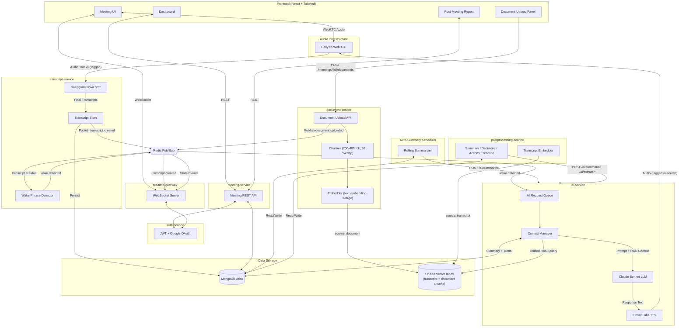
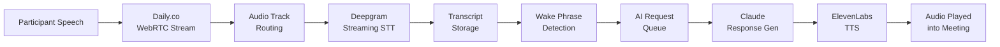
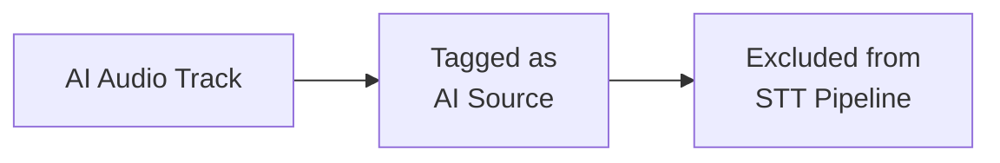
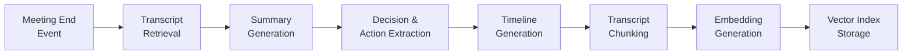
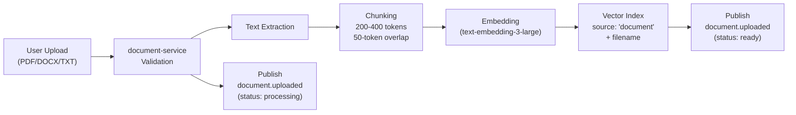
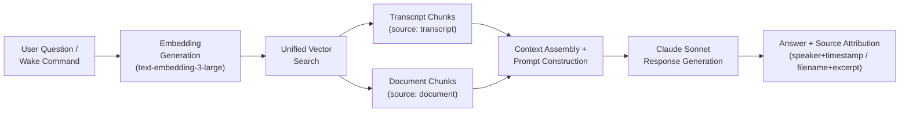
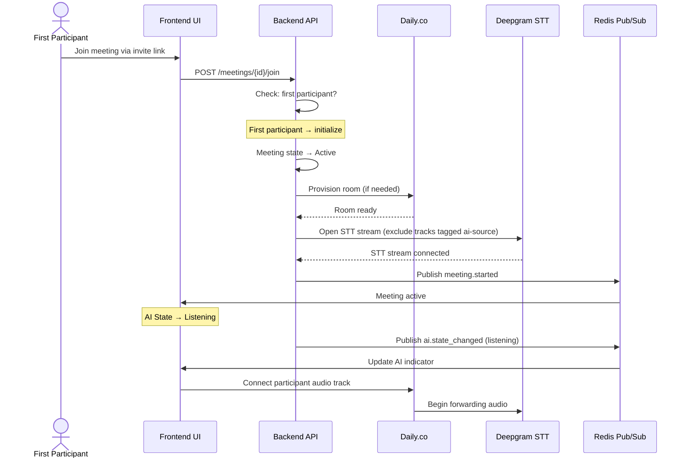
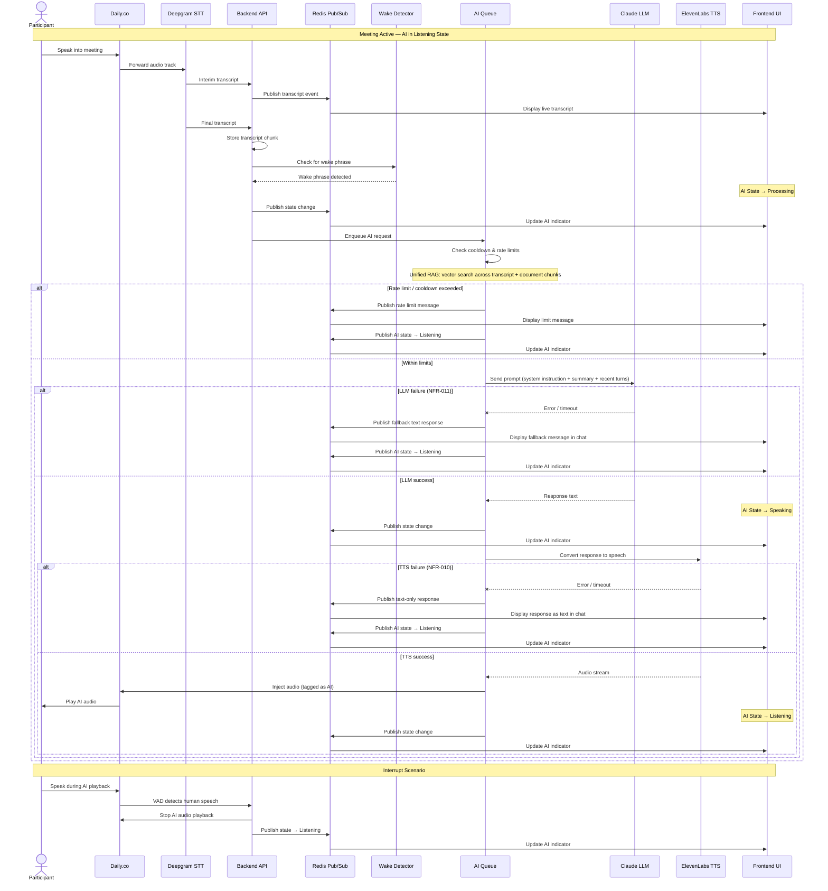
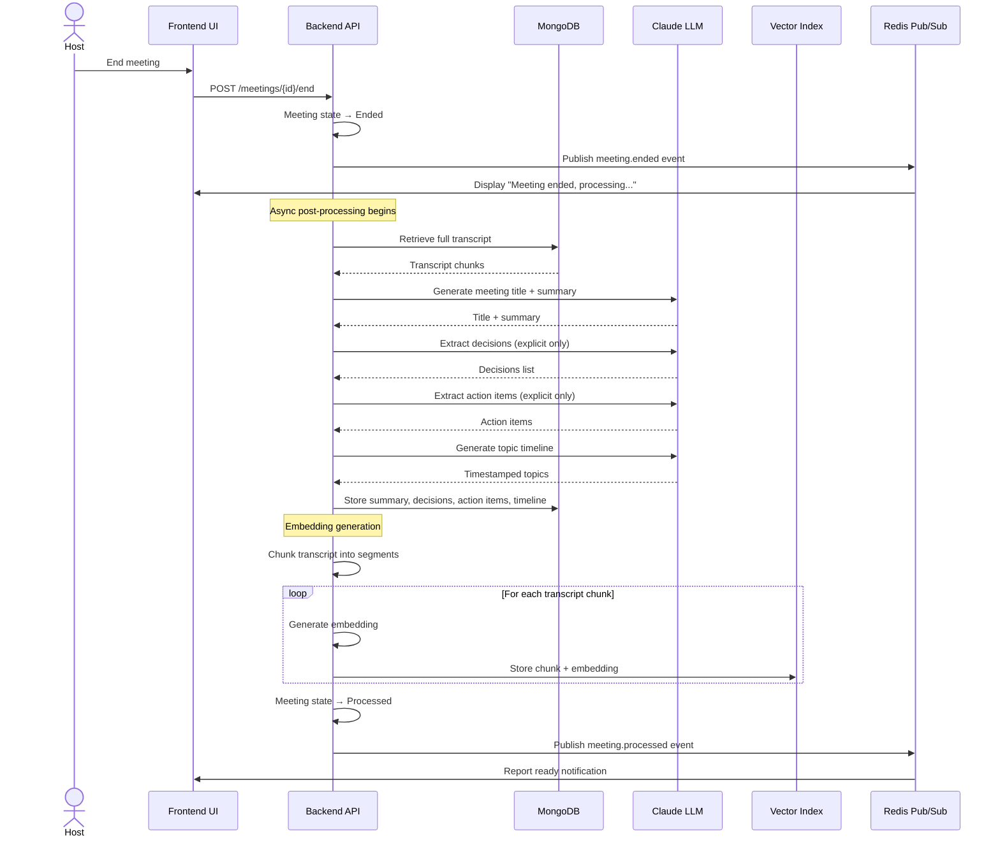
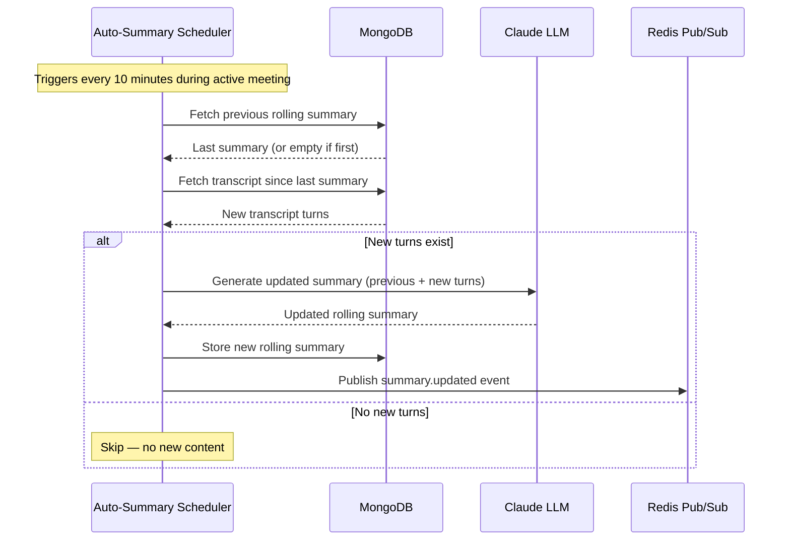

# Arni — System Architecture

Version: 3.0
Date: 2026-04-11

Detailed architecture diagrams and pipeline specifications for the Arni system.

For requirements, see [srs.md](srs.md).

---

## Table of Contents

1. [System Architecture Diagram](#1-system-architecture-diagram)
2. [Live Meeting Pipeline](#2-live-meeting-pipeline)
3. [Audio Feedback Loop Prevention](#3-audio-feedback-loop-prevention)
4. [Post-Meeting Processing Pipeline](#4-post-meeting-processing-pipeline)
5. [Document Ingestion Pipeline](#5-document-ingestion-pipeline)
5b. [Proactive Fact-Check Pipeline](#5b-proactive-fact-check-pipeline)
6. [Unified RAG Pipeline](#6-unified-rag-pipeline-question-answering)
7. [Event Bus Schema](#7-event-bus-schema)
8. [Meeting Initialization Sequence](#8-meeting-initialization-sequence)
9. [Live Meeting Sequence Diagram](#9-live-meeting-sequence-diagram)
10. [Post-Meeting Processing Sequence Diagram](#10-post-meeting-processing-sequence-diagram)
11. [Rolling Auto-Summary Flow](#11-rolling-auto-summary-flow)

---

## 1. System Architecture Diagram



---

## 2. Live Meeting Pipeline



---

## 3. Audio Feedback Loop Prevention

AI-generated audio must never be transcribed back into the meeting transcript.



---

## 4. Post-Meeting Processing Pipeline



---

## 5. Document Ingestion Pipeline

Triggered immediately after a user uploads a document (`PDF`, `DOCX`, or `TXT`) to a meeting room.



---

## 6. Unified RAG Pipeline (Question Answering)

Used both during live meetings (`/ai/respond`) and post-meeting Q&A (`/ai/qa`). Pulls context from **both** transcript and document chunks simultaneously.



---

## 7. Event Bus Schema

All events published to **Redis Pub/Sub** must conform to the following schemas. Consumers must not rely on undocumented fields.

### `transcript.created`
```json
{
  "event": "transcript.created",
  "meeting_id": "string",
  "speaker_id": "string",
  "text": "string",
  "timestamp": "ISO-8601",
  "is_final": "boolean"
}
```

### All Event Schemas

| Event | Required Fields |
|-------|----------------|
| `transcript.created` | `meeting_id`, `speaker_id`, `text`, `timestamp`, `is_final` |
| `wake.detected` | `meeting_id`, `speaker_id`, `command`, `timestamp` |
| `ai.requested` | `meeting_id`, `request_id`, `command`, `timestamp` |
| `ai.responded` | `meeting_id`, `request_id`, `response_text`, `source_type` (`"transcript"` \| `"document"` \| `"mixed"`), `timestamp` |
| `ai.state_changed` | `meeting_id`, `state` (`"idle"` \| `"listening"` \| `"processing"` \| `"speaking"`), `timestamp` |
| `fact.checked` | `meeting_id`, `speaker_id`, `original_claim`, `correction_text`, `source_document`, `source_excerpt`, `confidence_score`, `timestamp` |
| `meeting.started` | `meeting_id`, `host_id`, `timestamp` |
| `meeting.ended` | `meeting_id`, `host_id`, `timestamp` |
| `meeting.processed` | `meeting_id`, `timestamp` |
| `meeting.auto_ended` | `meeting_id`, `reason` (`"host_timeout"`), `timestamp` |
| `summary.updated` | `meeting_id`, `summary_text`, `timestamp` |
| `document.uploaded` | `meeting_id`, `document_id`, `filename`, `status` (`"processing"` \| `"ready"` \| `"error"`), `timestamp` |
| `participant.invited` | `meeting_id`, `email`, `invited_by` (user_id), `timestamp` |
| `participant.admitted` | `meeting_id`, `user_id`, `admitted_by` (user_id), `timestamp` |
| `participant.removed` | `meeting_id`, `user_id`, `removed_by` (user_id), `timestamp` |
| `participant.rejected` | `meeting_id`, `user_id`, `timestamp` |
| `host.transferred` | `meeting_id`, `old_host_id`, `new_host_id`, `timestamp` |

---

## 8. Meeting Initialization Sequence

Triggered when the **first admitted participant** joins a meeting. Arni is already present in the participant list from the moment the meeting was created (FR-008).



---

## 9. Live Meeting Sequence Diagram

Full request lifecycle from participant speech through AI response, including unified RAG context, interrupt, and error fallback paths.



---

## 10. Post-Meeting Processing Sequence Diagram

Triggered when the host ends the meeting. All processing steps run asynchronously via `postprocessing-service`, which calls `ai-service` internally.



---

## 11. Rolling Auto-Summary Flow

During active meetings, the system regenerates a rolling summary every 10 minutes to maintain context for long meetings.


